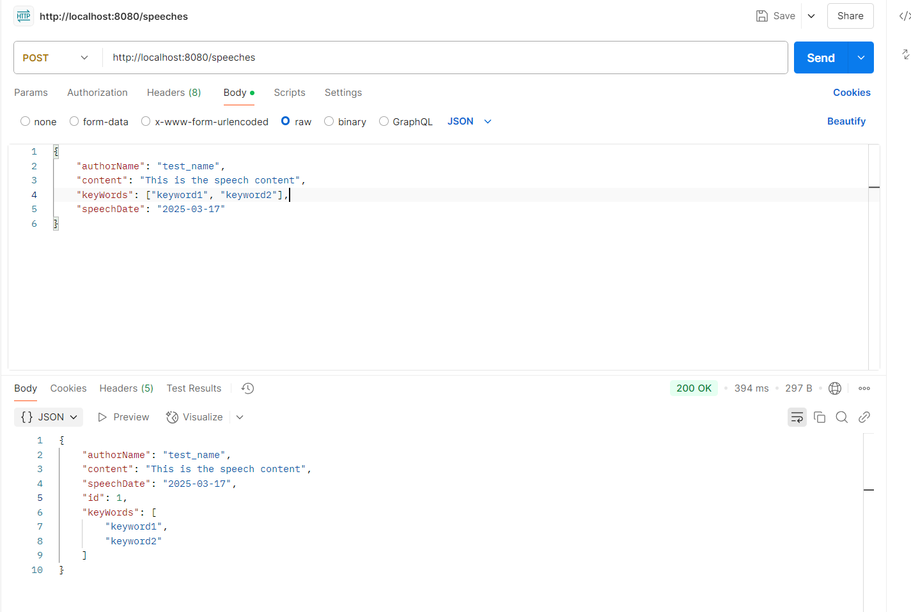
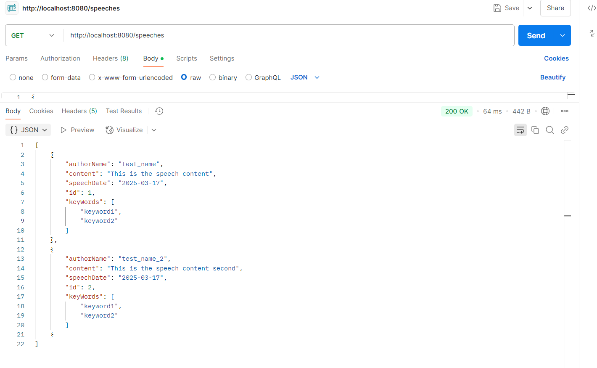
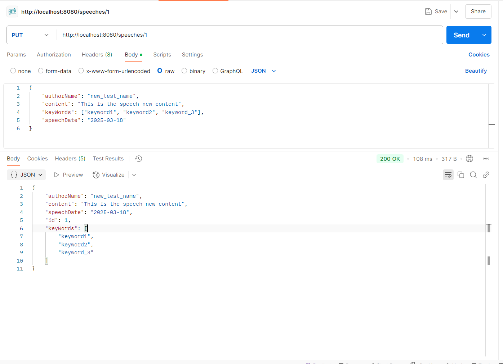
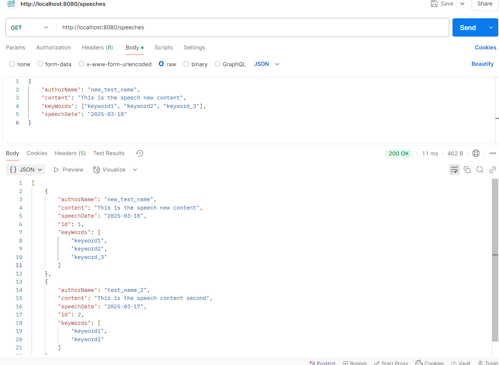

# Speech_Library_API

## Description
This is a Spring Boot-based back-end system designed for managing and storing speeches. It allows politicians to add, retrieve, update, view their speeches, providing easy access to their speech records.

## Features
- **Add a Speech**: Allows adding speeches with fields like speech title, content, speaker name, and speech date.
- **Get a Speech**: Retrieve a speech by its ID.
- **Edit a Speech**: Edit an existing speech.
- **View all Speeeches**: Retreives all speeches created by the user

## Tech Stack
- **Spring Boot**: For building the back-end system.
- **H2 Database**: In-memory database for storing speech records.
- **JPA/Hibernate**: For ORM-based database operations.
- **Postman**: For testing and interacting with the API.

## Images of Postman Endpoint Testing'
## Add a speech endpoint

## Get all speeches endpoint

## Edit a speeech endpoint

## Getting all speeches after editing Speech 1

